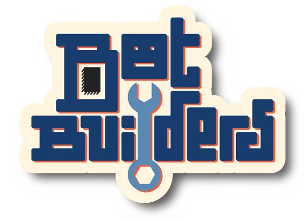





This page is the home of Bot Builders.

Bot Builders is an tableau-building (and robot-building) game for 2-4 players ages 12 and up.
Play takes around 30-90 minutes.
Your goal is to create and customize a group of robots to earn points in an arena game.
To do this, you'll need to build up your team of engineering students.





## Status

Bot Builders has been tested at [Protospiel Online][], and is currently in preparation to pitch to publishers.
In addition to the core game, there are several planned mechanics that could be made as separate expansions.
The goal for future development is to put out focused expansions that each add a new mechanic or archetype to mix up gameplay.

The [Sell Sheet][] is available for download here.

Resources including the Print and Play and testing information can be found in the [Assets][] link, currently a Google Drive folder.

## Playtesting

Current playtesting is available at the following locations:

- [Screentop.gg](https://screentop.gg/@msoucy/bot-builders)

[Protospiel Online]: https://protospiel.online/
[Assets]: https://short.msoucy.me/botbuilders-assets
[Sell Sheet]: sell-sheet.pdf
